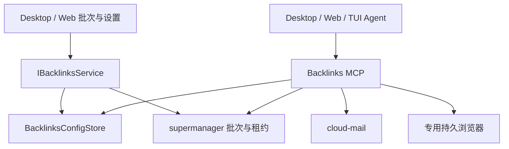

# link-harness 2.0.0 外链能力迁移规范

## 版本与范围

源：javawl/link-harness tag 2.0.0，commit 3f2de21104493f4c00214a0c1dfc0836b63b6e14。
目标基线：javawl/ZCode-Link main，commit 872ad960de7ec172591f7e1952f7849229f94521。
迁移批次与租约、结果回写、来源标签、互链 badge、验证邮箱、批次控制台与配置，以及 backlink-publish / google-session 两项技能和所有指南。
保留源 MIT 归属；不迁移用户运行记录、Cookie、真实凭据和工作数据。

## 原生边界与唯一状态所有者

- packages/backlinks（@zcode/backlinks）：公开类型、错误与运行时校验；HTTP / 配置文件 adapters；应用层按每次调用读取有效配置并选用 provider。公开入口 src/contract.ts（浏览器安全类型）和 src/node.ts（Node adapter 工厂）。
- apps/zcode-cli/packages/backlinks-plugin：官方可启用插件，MCP 工具 backlinks / backlinks_browser / backlinks_status，以及迁移后的两项技能。commands/backlink-publish.md 将原生 /backlink-publish 命令映射到发布技能，保留用户参数。通过现有插件宿主和权限入口启动；按需启动浏览器。
- packages/services 的 IBacklinksService：仅 getSettings、updateSettings、listBatches、getBatch 四个方法，通过既有 RPC 供 Desktop/Web UI 使用。
- UI 只拥有搜索、勾选、展开、加载等临时状态。批次/条目/lease/发布记录唯一事实源是 supermanager；邮箱事实源是 cloud-mail。UI 不自行维护任务队列。
- 配置唯一持久化适配器为 BacklinksConfigStore，位置为 <dataBaseDir>/.zcode/v2/backlinks.json。dataBaseDir 与现有 ZCODE_DATA_BASE_DIR / homedir 规则一致，由宿主注入。MCP 与 UI 使用同一文件，每次操作读取以支持热更新；原子写入、并发更新串行化、权限 0600；只向 UI 返回 tokenConfigured。
- 专用发布浏览器由插件浏览器 adapter 独占持久 profile，保留跨运行登录态、文件上传及可人工接管的 headed 模式；相同页面按顺序执行。插件关闭释放浏览器；第二进程占用 profile 时返回可操作错误，不删除活进程锁强行接管。只允许回收本机、格式明确且 PID 已证实不存在的遗留锁，回收通过独立互斥保护并复核文件身份；未知锁保持不动。

## 功能契约

1. backlinks 动作与源一致：batch_list、batch_get、batch_claim、lease_heartbeat、lease_release、item_result、badge_add、source_tags、mailbox_create、mail_wait，并保留已支持参数。
2. 批次包含网站资料包、anchors、submitUrl、sourceNotes、分类/标签、支付类型、已发布 URL/状态等所有源字段。
3. 结果闭合联合：live（公开核验 URL+anchor+target）、submitted、failed（retryable/manual_required）、skipped（skipReason）。结果未知不能自动重放提交。已发布条目及同来源重复项禁止重复发布；保留人工解除后显式选择 manual_required 的能力。
4. lease 由服务器授予；仅授权领取的 item 可进入执行；约每 30 秒 heartbeat，失败后停止新的不可逆提交；完成或取消后 release。未知回写结果应先读取核对，不重放网站提交。
5. provider 保留源 HTTP 路由、认证、响应 envelope、错误分类、Retry-After、15 秒单请求超时、取消和有界邮件轮询。变更配置不需重启。邮箱等待默认 120 秒 / 间隔 5 秒；整个 MCP 调用有界。
6. 配置：supermanager / cloudMail 的 baseUrl 和 write-only token，mailboxDomain，以及 browser 的 executablePath、headless（默认 false）、channel（默认 chrome，使用已安装的 Google Chrome）。token 空白编辑保留旧值，clearToken 显式删除；非法 URL / 类型不能覆盖原配置。
   浏览器保留可选 launchArgs、ignoreDefaultArgs、windowPosition 配置，以兼容源启动参数；默认使用可见标准 Chrome。禁止参数覆盖 profile 目录。改变浏览器配置后 close 再打开即重新读取；API 地址与令牌每次调用读取。正常 MCP 关闭以五秒有界请求释放已知租约，未知 claim 响应依赖后端租约到期与人工核对。
7. 新环境变量仅用于启动配置 fallback：ZCODE_BACKLINKS_SUPERMANAGER_BASE_URL、ZCODE_BACKLINKS_SUPERMANAGER_TOKEN、ZCODE_BACKLINKS_CLOUD_MAIL_BASE_URL、ZCODE_BACKLINKS_CLOUD_MAIL_TOKEN、ZCODE_BACKLINKS_MAILBOX_DOMAIN。优先级：有效持久化字段 > 新环境变量 > 源版本兼容环境变量（如源配置声明）；缺失时明确报配置错误，不猜测服务地址或邮箱域名。浏览器设置优先配置文件。
8. backlinks_browser 保留 navigate / snapshot / click / fill / select / press / upload / screenshot / waitFor / bringToFront / closePage，增加 tabs 与 close/status 供观察 OAuth 和正常关闭。保持 source page refs、语义/iframe/坐标 selector、ARIA 快照、上传能力；返回的图片与文本遵守 MCP 内容协议。上传限制在用户工作区的真实文件，明确拒绝越界路径。
9. 技能保留六类站点 playbook、证据与状态、Google 会话；使用实际工具名与 schema。移除源中的固定邮箱域名、未经核验的回调地址与互相矛盾的并发指令。浏览器并发以页面隔离为前提；同域/同项不可并发提交，未知结果交人工核验。

## UI 验收

- 批次按数字 ID 降序，搜索网站/主机/ID，展示状态计数与执行中标志，详情按需加载，30 秒刷新。
- 多选与“全选当前过滤结果”保留隐藏选项；去重后按 ID 降序生成 /backlink-publish 批次列表。
- “批量发布”创建并提交一次正常 Agent 会话输入，走现有 admission；失败保留选择，成功清空并导航/提供任务入口。
- 插件默认关闭时，界面明确说明“发布时启用当前工作区的 Backlinks 插件”；点击后先通过既有 pluginManagementService 启用并核对状态，再创建任务。启用失败不创建任务，保留选择。
- 新设置界面遵守 DESIGN.md、主题、中英文和手机 Web 布局。Token 不返显；更新失败保留旧配置。
- Desktop、Web、远程工作区通过既有 service 访问对应宿主的数据；TUI 使用同一 MCP 工具/技能。

## 构建与验证

- backlinks 官方插件默认关闭，需用户在插件设置或 CLI 中显式启用。MCP isolation=workspace 必须从 manifest 保留到已有连接池，同 workspace 的会话共享实例；不同 workspace 不共享页面。发布 profile 按 workspaceIdentity 或实际 workspacePath 的 SHA-256 分目录。
- MCP server 为 dist/mcp/server.js；完整 Playwright 核心模块复制到 runtime/playwright-core，构建时重写其模块引用；不打包浏览器二进制。Desktop、SEA、远程和开发构建必须验证服务器、配置入口、两项技能、命令别名、docs/browser.md 与 Playwright 入口均存在。
- 除原有十动作与浏览器工具外，提供只读 backlinks_status 返回脱敏配置与准备状态；命令行配置入口从 stdin 读取 JSON，凭据不放命令行参数或模型上下文。
- 补齐官方插件发现、seed、CLI/SEA、桌面本地与远程资源、Web 服务资源路径，避免只在源码下可用。
- 实现前准备测试：HTTP 路由/envelope/错误/取消、邮件筛选与超时、配置热更新/保密/原子失败、命令 schema 与结果/lease、批次选择与提交失败、浏览器真实本地页面交互/上传/持久 profile。
- 实际运行 root typecheck/lint、CLI typecheck/lint、architecture:check --changed、相关单元/集成与可运行的 UI E2E。分清迁移新增问题、既有失败、环境限制；不把模拟通过称为真实网站发布通过。
- 不连接用户真实生产 API、不登录真实账户、不发布真实外链来测试。本次授权为迁移、验证和更新 GitHub。
- 最终中文 Markdown 交付包含迁移矩阵、使用配置、路径、测试原始结果摘要、限制、提交与回滚步骤。
