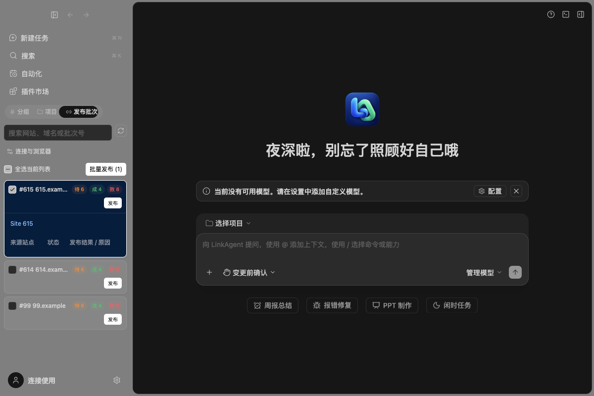
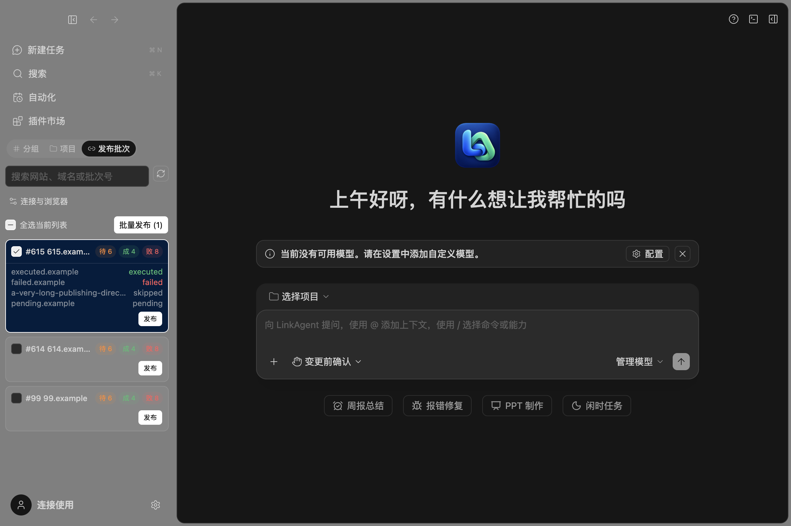
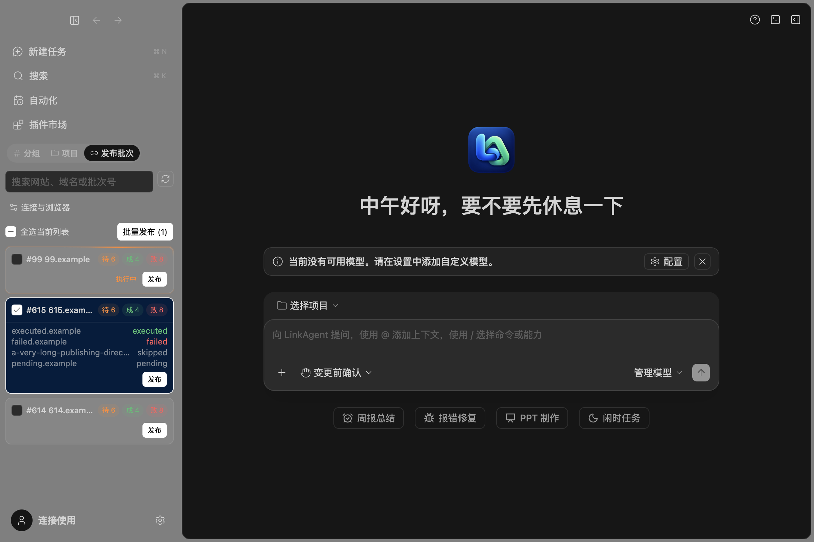

# 发布批次侧栏与 401 修复

## 完成内容

- 侧栏顺序为「分组 / 项目 / 发布批次」，发布批次位于项目右侧；旧的独立「外链发布」按钮移除。
- 参考指定 deepseek-harness 的 `ui-backlinks-console/SidebarPanel.tsx`，使用紧凑的批次号/域名、待/成/败计数、复选框和行级发布按钮。
- 执行中批次置顶，两组内各按数字降序；保留搜索、全选、多选批量发布、单批发布及展开详情。发布继续走已有插件启用、任务创建与 admission。
- 「连接与浏览器」进入已有配置页；配置页不再展示或轮询第二套批次列表。离开批次 tab 时停止其轮询，不改变项目/分组持久化偏好。
- 保留 Desktop continuous、Web replayable、workspaceIdentity、remoteSessionId 和 stale ACK 防护。

## 401 原因与处理

已做只读对比：两个客户端使用相同服务地址和 `Authorization: Bearer …` 格式；LinkAgent 保存的令牌返回 HTTP 401，参考 harness 的令牌返回 HTTP 200。

通过现有原子配置 writer，将参考 harness 中已验证的 Agent Token 更新到 **LinkAgent 当前独立数据目录**。之后实际 HTTP 查询及 LinkAgent 外链运行时查询均成功，验证时返回 **178 个批次**。

凭据没有写入源码、测试或本文；没有修改服务端认证、轮换凭据或执行生产写操作。401/403 现在会明确提示检查 Agent Token，并提供连接设置入口，不回显令牌或后台响应正文。

## 验证

- 外链配置、HTTP 适配器、runtime、命令和 UI store：**22 项通过**。
- 真实 Electron 侧栏 E2E：通过。使用本地模拟服务验证错误令牌 → 设置修正 → 查询恢复、第三 tab、搜索/多选/详情及视图切换，未调用后台发布接口。
- 真实 Chrome UI E2E：通过。验证发布 admission 的模拟提交、失败恢复、设置保存、主题与手机宽度布局。
- `pnpm typecheck`、`pnpm lint`、`pnpm architecture:check --changed` 和格式检查通过；lint 66 warnings / 0 errors，架构 0 新违规。
- 真实后台仅执行 GET 查询；没有真实发布、认领、结果回写或邮件发送。Windows/Linux 实机未验证，未推送或部署。

相关入口：`WorkspaceSidebar.tsx`、`WorkspaceSidebar/BacklinksSidebarPanel.tsx`、`settings/backlinks/BacklinksConsole.tsx`。服务和配置仍由原 backlinks 模块拥有，未引入第二条配置写入路径或后台队列。

本轮主要改动模块为 UI 和 backlinks 适配器；相对本轮开始时的代码与配置文本净增加 333 行（含新增测试，不含文档/图像），保留先前免登录、品牌和去商业化修改。

## 展开条目样式

侧栏详情采用参考 harness 的紧凑两列列表：左侧来源域名，右侧原始状态；executed 为绿色，failed 为红色，其余灰色。长域名单行省略并可悬停查看，发布按钮位于列表底部。宽屏完整详情模式仍保留。

本轮仅修改 UI 渲染，生产代码净增加 52 行；不改批次数据、选择或发布链路。桌面 E2E 验证四种状态、紧凑行高、右对齐、长域名省略及无横向溢出；类型、lint 和架构检查通过（66 warnings、0 errors；架构 0 baseline / 0 new）。未执行真实发布或推送。

## 执行中置顶与发布后保留 tab

执行状态以后台 `executing` 为准：运行批次优先显示，组内按 ID 降序，执行结束后随刷新回到普通组。卡片采用沿边框旋转的主题警示色灯效，保留“执行中”文字；减少动态效果时使用静态高亮，装饰层不阻挡操作。

发布成功回调原先主动关闭批次 tab，导致跳回项目；现已移除该侧栏切换。主区仍打开正常接纳的新任务，侧栏保留列表、搜索和展开状态。没有新增后端执行状态、队列或写接口；唯一 UI 投影仍为 `BacklinksConsoleStore`。事件顺序见 [规格](./BATCH-RUNNING-SPEC.md)。

验证：8 项 UI store / 发布链路测试通过，Web 交互 E2E、Electron 侧栏 E2E 和完整本地发布 E2E 均通过；涵盖置顶和结束恢复、灯效实际旋转、减少动态效果、深浅主题、选中状态、窄屏以及发布成功后 tab 保持。根类型检查通过，lint 为 66 warnings / 0 errors，架构 0 baseline / 0 new。本轮仅改 UI，生产代码净增加 49 行。没有为本次测试向真实网站发布或写入生产批次，未推送或部署。Windows / Linux 实机未验证。

验证当前窗口期间，无障碍工具对标签赋值触发 Electron 主进程 SIGSEGV，原生堆栈位于 `NSAccessibilityEntryPointSetValueForAttribute`；已停止使用该操作，恢复应用并通过普通鼠标点击返回发布批次。没有自动重提发布任务。此前运行的真实批次需先核对任务和后台结果，再决定是否继续，不能把重开界面当作已经恢复发布。此原生无障碍崩溃未在本轮修复。

