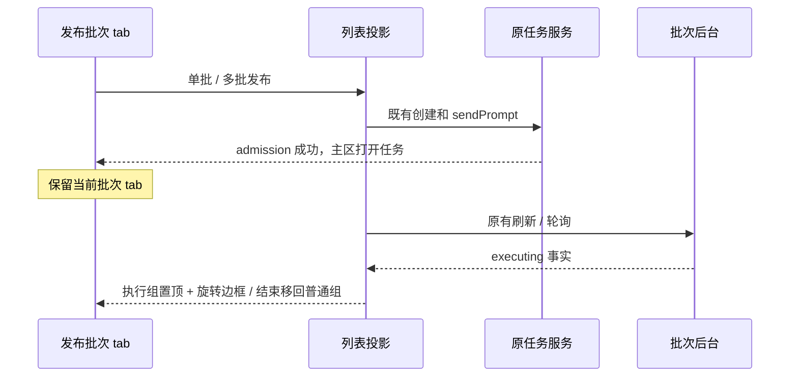

# 发布批次执行状态展示

- 列表先按后台 `executing=true` 置顶，再在执行中 / 非执行中两组内按批次 ID 降序。搜索只筛选，不改变组内顺序；刷新后已结束批次自动回到非执行组。
- `BacklinksConsoleStore` 仍是同一宿主查询结果的唯一 UI 投影。`publishing` 仅代表提交任务请求，不伪装成后台执行状态，不引入第二份执行队列或计时补偿。
- 执行中卡片使用沿边框旋转的暖色灯效，保持“执行中”文字；普通卡片无动效。沿用 warning 主题色，兼容浅/深色、窄侧栏及展开详情，装饰层不拦截鼠标。减少动态效果偏好下显示静态高亮。
- 单批 / 多批发布成功后，侧栏保持“发布批次”tab、搜索、展开和滚动位置。主区仍使用原来的 task admission 与 active task 显示新任务；不再通过成功回调切换到项目 tab。失败保留当前列表与选择，并继续显示原错误。
- 不改变 Desktop continuous、Web replayable、workspaceIdentity / remoteSessionId 或 stale ACK 防护，不修改后端或生产数据。

验收：状态切换排序、搜索与选中状态保持、灯效实际旋转、停止后移除、减少动态效果、浅深主题、窄屏、真实 Electron 发布后 tab 保持及本地完整发布回归；执行根 typecheck / lint / 架构检查。
