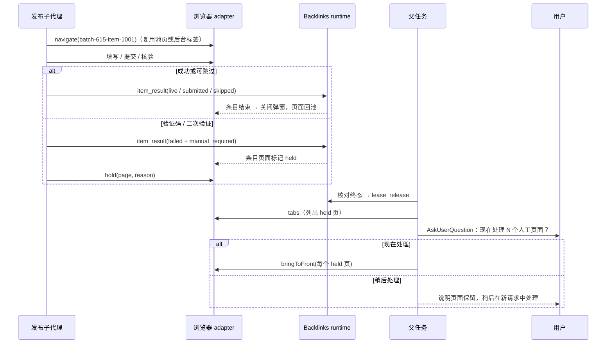

# 外链浏览器后台静默运行与页面回收规格

## 目标

1. 日常发布浏览器以正常可见窗口运行：发布任务在同一个窗口的标签页中执行，空闲标签回收复用，不因发布流程额外打开新窗口；需要静默运行时可选择后台模式（窗口停靠屏幕外，不抢占前台）。
2. 页面不堆积：页面生命周期由浏览器 adapter 按条目结果、空闲时间与数量上限自动回收，不依赖模型记得 `closePage`。
3. 人工处理集中到批次末尾：子代理遇到验证码、二次验证等阻碍时只标记并保留页面，批次结束后由父任务一次询问用户是否现在处理。

不改变：批次、条目、租约与发布结果仍以 Supermanager 为唯一事实源；不重放结果未知的提交；双问答门槛、3 槽并发与同域串行不变；不修改 Web/远程协议与生产配置。

## 实测依据（macOS 26.6.2，Google Chrome 153，Playwright 1.59.1，临时 profile）

| 场景                                                                       | 结果                                                                                                               |
| -------------------------------------------------------------------------- | ------------------------------------------------------------------------------------------------------------------ |
| `launchPersistentContext` 有界面启动                                       | Chrome 成为前台应用（抢焦点）                                                                                      |
| 对 Chrome 进程执行 `NSRunningApplication.hide` 后立即 `unhide`             | 前台恢复为启动前的应用；Chrome 不再是前台                                                                          |
| 只 `hide` 不 `unhide`                                                      | 页面截图超时，不可用于持续自动化                                                                                   |
| 用户在场时最小化窗口中的页面                                               | `visibilityState=visible`，截图约 40ms，填写/键盘输入/rAF 正常                                                     |
| 锁屏时（前台为 loginwindow）最小化窗口中的页面，或最小化后执行 hide→unhide | rAF 停止，导航后截图超时（15s）；**最小化不可用于无人值守**                                                        |
| 锁屏时 normal 状态窗口（停靠在屏幕外）                                     | rAF、截图（约 45ms）、表单、后台标签、新窗口、弹窗均正常                                                           |
| `Browser.setWindowBounds` 请求 `left:-32000, top:32000`                    | Chrome 夹取到最近显示器左下角，仅保留约 40×100 像素；窗口最小尺寸 500×375；页面视口仍按 Playwright 模拟为 1280×720 |
| 浏览器级 CDP `Target.createTarget({background:true})`                      | 不抢前台；但所在窗口会恢复默认尺寸/状态，需要立即重新停靠                                                          |
| `Target.createTarget` 的 `windowState:"minimized"`                         | 参数被接受但无效，窗口仍为 normal                                                                                  |
| 站点 `window.open` 弹窗                                                    | 用户在场时抢前台；停靠弹窗窗口并 hide/unhide 后约 0.9s 恢复                                                        |
| 多显示器（本机主屏右侧有第二屏）                                           | 按主屏边缘计算的停靠位置会落到第二屏，因此改用极远坐标交给 Chrome 夹取                                             |
| `page.bringToFront()` + 窗口恢复 normal                                    | Chrome 成为前台（用于用户同意的人工处理）                                                                          |
| `context.browser().newBrowserCDPSession()`                                 | 持久 context 可用；Chrome 主进程是 MCP Node 进程的直接子进程                                                       |

## 显示模式

`browser.displayMode`：`"background" | "visible" | "headless"`。

- `visible`（默认）：有界面 Chrome 以正常窗口运行。发布页面一律在既有窗口内以标签页打开（优先复用空闲池中的标签），不新建窗口、不停靠、不归还前台；同一任务使用同一逻辑页名即始终在同一标签。站点弹窗由 Chrome 正常打开。
- `background`（可选静默模式）：有界面 Chrome。窗口一律保持 normal 状态并“停靠”（`left:-32000, top:32000, 500×375`，由 Chrome 夹取到显示器角落，仅剩细边），不使用最小化。启动后立即停靠初始窗口并在 macOS 把前台还给原应用；新页面通过浏览器级 CDP 以后台标签创建，已知存在用户窗口或显示中窗口时以 `newWindow` 新建自有窗口，创建后立即重新停靠；站点弹窗出现即停靠其窗口并归还前台；除 `bringToFront` 外不做任何激活。`bringToFront` 把窗口移回可见位置（80,80，1280×900，同样由 Chrome 夹取）。
- `headless`：现有无窗口模式。
- 兼容：未设置 `displayMode` 时，旧 `headless:true` 映射为 `headless`，其他情况映射为 `visible`。快照同时返回 `displayMode` 与派生的 `headless`（`displayMode === "headless"`）。`BacklinksConfigStore` 仍是唯一写入方。历史文件中旧版本写入的 `displayMode:"visible"` 与新缺省同义；旧版本缺省（未写 `displayMode`）曾表示后台，升级后按新缺省解析为可见，需要后台的用户在设置中重新选择即可（此后显式持久化）。
- 最小写入：`visible` 不写 `displayMode`（缺省即可见），`headless` 只写旧字段 `headless:true`，静默用 `background` 写入 `displayMode:"background"`。只发送 `headless` 的旧客户端：`true` → 无窗口；`false` 从无窗口回到默认可见，其余保持原模式。这样未改显示方式（或只在可见/无窗口间切换）的配置文件仍能被旧版本读取。
- 前向容忍：读取配置文件时保留未知字段（顶层与 `browser`），写回时原样保留，但不投影到快照或运行时；用户输入（设置界面、stdin 配置脚本）仍严格校验未知字段。
- 前台归还只在 macOS 实现：通过 `lsappinfo front` 判断前台进程是否为本插件启动的 Chrome 主进程（按 PID，不按 bundle id，避免误伤用户日常 Chrome），是才执行一次 hide→unhide。失败只记录，不阻塞自动化。Windows / Linux 仅做后台标签与停靠。
- CDP 复用用户浏览器时：只以后台标签创建页面；绝不移动、隐藏或归还用户浏览器的前台；不启用页面池（回收即关闭自建页）。
- 窗口归属：后台模式只停靠和放入自动化标签的“自有窗口”（启动窗口、为自动化新建的窗口、自动化弹窗窗口）。后台标签若被 Chrome 放进用户自行打开的窗口或显示中的窗口，立即关闭该标签，改为以 `newWindow` 新建自有窗口并停靠；已知存在用户窗口或显示中窗口时直接以 `newWindow` 创建，不在用户标签栏中闪出临时标签。自有窗口中一旦出现外来页面即转为用户所有，停靠（包括最后一个显示页结束后的重新停靠）与空闲池复用都跳过这类窗口。
- 显示（revealed）：`bringToFront` 把该页窗口移到可见位置并记为显示中窗口；显示中窗口不停靠、不接收新的自动化标签，其中的空闲池页面关闭而不复用；用户在显示页上打开的弹窗本身计为显示页。自动化弹窗照常停靠；打开链上有显示页的弹窗视为用户操作产生，保持原样。有显示页时不做前台归还（用户可能正在该 Chrome 中操作）。所有显示页关闭或回收后重新停靠自有窗口；显示过的页面关闭而不回池。
- 隐藏修复：macOS 下每次为新页名取页前、以及前台归还尝试之后，若插件 Chrome 处于隐藏状态则取消隐藏（不激活），避免 Cmd+H 或被打断的 hide→unhide 让截图挂起。

## 页面生命周期（浏览器 adapter 唯一所有者，进程内内存状态）

模型继续使用逻辑页名；adapter 维护 `逻辑页名 → 物理页面` 记录：`{ name, page, itemId?, batchId?, openerName?, lastUsedAt, held?: { reason, since }, revealed? }`。

- 条目绑定：页名匹配 `^batch-(\d+)-item-(\d+)(?:[-_/].*)?$` 时绑定 `batchId/itemId`；站点弹窗按 opener 链继承绑定。
- `navigate` 新页名：优先复用空闲池中的页面（已导航到 `about:blank`），否则新建。自有浏览器空闲池上限 3；超出直接关闭。
- 不变量：一个物理页面只有一个逻辑名（显式页名替换并发 `tabs()` 收养的临时别名）；空闲池中的页面没有逻辑名；正在清空回池的页面不被 `tabs()` 收养。
- 外来页面：非本插件创建的标签（用户自行打开或站点 noopener 新标签）照常列出，但回收只解除页名，绝不清空、回池或关闭；自有浏览器中存在外来标签时不做整体空闲关闭。
- 重试：对仍被保留的页名再次 `navigate` 视为新工作，旧页面随旧保留结束（显示过则关闭，否则回池），新工作使用新的停靠页面。
- `item_result` 成功回写（`backlinks` 与 `backlinks_worker` 两个入口）后，由 handler 通知 adapter：
  - `live` / `submitted` / `skipped` / `failed+retryable`：关闭该条目绑定的弹窗，页面导航到 `about:blank` 后回池；逻辑页名解除。
  - `failed+manual_required`：该条目绑定的页面标记 `held`（reason `manual_required`），不回收。
  - 浏览器未启动时不为此启动浏览器；回收失败不影响 `item_result` 的成功结果。
- `hold` 动作：把指定页标记为 `held`（可带简短 reason），不改变窗口。显式 `hold` 的原因会替换自动保留的 `manual_required`；自动保留不会覆盖已有原因，保留起始时间不变。
- `bringToFront`：显示指定页（恢复窗口、激活标签与 Chrome），标记 `revealed`。仅用于用户已同意的人工处理或用户主动发起的 Google 登录。
- `closePage`：解除逻辑页名；自有浏览器中回池，CDP 模式中关闭。
- 空闲清扫（每 60 秒，定时器 `unref`）：
  - 非 held、非执行中、10 分钟未使用的页面回收；弹窗继承打开链的保护：祖先被保留时随保留一起，祖先显示中时按 30 分钟；
  - held 超过 24 小时关闭；
  - 没有逻辑页、没有 held 页且 30 分钟无浏览器活动时关闭整个浏览器（profile 登录态保留；CDP 模式仅断开）。宿主提供 `onIdleClose` 时此运行时随之结束，宿主在下次调用时等待旧运行时释放 profile 锁，再按最新设置重建，使显示方式等浏览器设置变更生效；浏览器设置变更后，若当前运行时没有任何页面（含保留页与外来标签）、排队动作或启动中的会话，下一次调用即按新设置重建；
  - 清扫在定时器中运行，任何失败只记录，不形成未处理的拒绝；关闭失败不会阻止之后重新启动；关闭期间启动完成的会话不会留下清扫定时器。
- 所有回收与关闭操作排入该页现有的串行队列，永不在动作执行中关页；页面被用户手动关闭时记录自动移除。
- `item_result` 之后该页名失效，后续页面动作返回 `BROWSER_PAGE_NOT_FOUND`；技能要求公开核验等页面工作在回写前完成。

## 工具契约

- `backlinks_browser` 新增 `{ "action": "hold", "page": string, "reason"?: string(≤200) }`，返回 `acked`。
- `tabs` 每项增加可选 `held: true`、`holdReason`、`itemId`。
- `status` 返回 `{ kind, running, headless, persistent, displayMode, pages, heldPages }`。
- 其余动作 schema 不变。

## 技能交互

- 子代理：遇到验证码、二次验证、账号所有者输入、付费等阻碍时，写 `failed + manual_required`（证据说明阻碍），再调用 `hold`；不调用 `bringToFront`、`closePage` 或全局 `close`。所有页面核验必须在 `item_result` 之前完成。
- 父任务：全部条目核对并 `lease_release` 之后输出汇总；若 `tabs` 中有 held 页，调用一次 `AskUserQuestion`（“现在逐个处理” / “稍后处理”）。选择现在处理时，依次 `bringToFront` 每个 held 页并列出条目与原因；选择稍后或取消时说明页面保留（最长 24 小时），下次在新请求中选择这些 manual_required 条目重试。
- 用户主动发起的 `google-session` 仍直接 `bringToFront`，不延后。
- 批次结束不调用全局 `close`。

## 失败语义

- 前台归还、停靠、后台标签创建失败：记录后回退到普通 `newPage()`，不阻塞发布，不重试提交。
- 页面回收失败：关闭该页；关闭仍失败则丢弃记录。
- 用户在人工处理期间关闭标签：记录移除，不影响后台条目状态。
- 降级风险：旧版本的配置 schema 为严格对象。只有选择“后台”后文件才含 `displayMode`，此时旧版本（含未重新构建的开发产物，本地 E2E 已实际复现）读取会报解析错误；回退旧版本前把显示方式改回可见或无窗口即可。

## 验收

1. 配置：缺省为 `visible`；旧 `headless:true` 读为 `headless`；保存 `displayMode` 后重读一致（`visible`/`headless` 不写 `displayMode`，`background` 写入）；非法值拒绝且不覆盖原配置。
2. 运行时（fake Chromium）：页面池复用、`item_result` 各状态的回收/保留、弹窗随条目关闭、`hold` / `tabs` / `status` 字段、空闲清扫与 held TTL、执行中动作不被回收、CDP 模式不入池；可见模式下发布页面都在既有窗口的标签页中打开，不新建窗口。
3. Handler：两个 `item_result` 入口都触发回收；浏览器未启动时不启动；回收失败不影响结果。
4. 真实 Chrome（macOS，`ZCODE_BACKLINKS_FOCUS_TEST=1`）：后台模式完整本地流程中普通发布与回收阶段 Chrome 从不成为前台，启动与弹窗阶段各不超过 2 秒；锁屏状态下截图与脚本正常；回写后只剩 held 页。
5. 设置界面三档选择（可见窗口为推荐默认）、中英文；本地完整发布 Electron E2E 通过并断言回写后该条目页面不再出现在 `tabs`。
6. 执行 `pnpm typecheck`、`pnpm lint`、`pnpm architecture:check --changed` 与相关包测试，如实报告。
