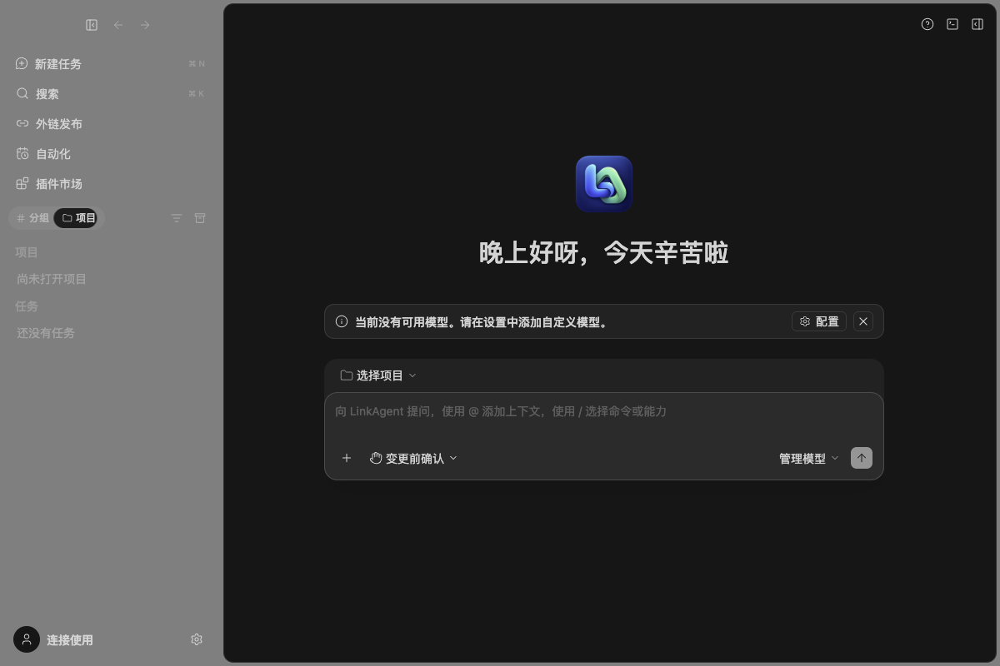
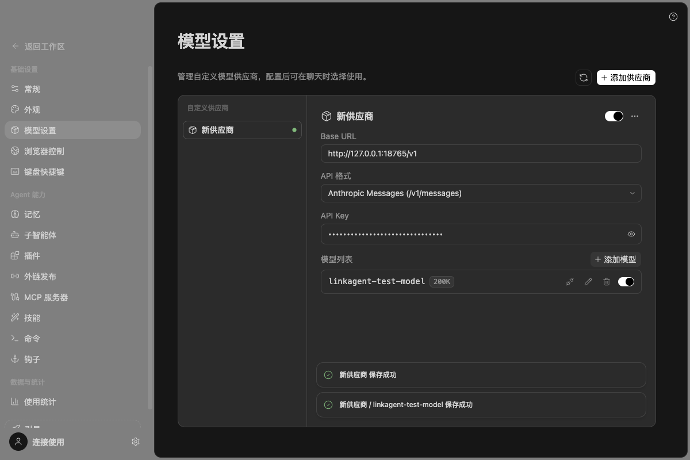
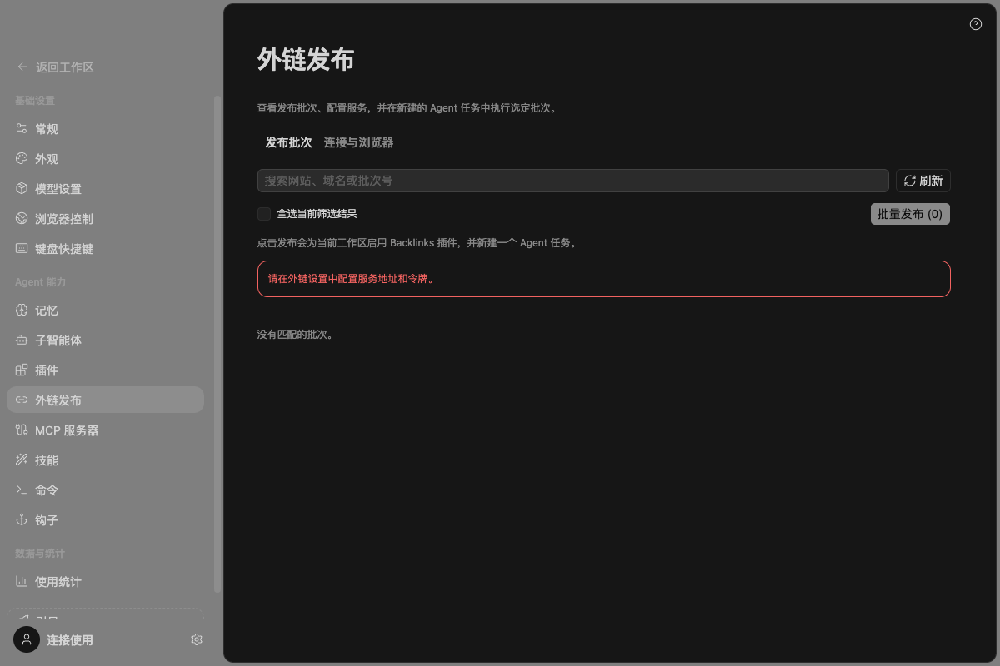

# LinkAgent 客户端交付说明

## 已完成

客户端现在无需登录即可进入主界面。空白配置也能访问设置、项目和外链发布入口；用户在「设置 → 模型设置」中自行配置模型。未配置模型时发送按钮保持禁用，界面提供配置入口。

- 启动时不再强制显示账号登录和职业偏好引导。
- 保留可选账号连接，登录页新增「返回主界面」。账号失效或退出账号不重新强制进入登录页。
- 自定义模型复用已有服务、RPC、配置文件和模型选择链路，没有另建一套模型存储。
- 显示品牌更新为 **LinkAgent**，开发应用为 **LinkAgent Dev**，预览应用为 **LinkAgent Preview**。已更新窗口标题、主界面、侧栏标志、启动图、关于页和中英文产品文案。
- 桌面安装身份使用 `dev.linkagent.app`，Linux 包名/可执行名使用 `linkagent`。开发与预览身份独立。
- 已生成并接入新图标：PNG 母版、macOS ICNS、Windows ICO、Linux 多尺寸 PNG、安装器图标与 Web favicon。
- 停用上游 ZCode 自动更新及强制更新，避免改名后的客户端被原版更新包覆盖。

## 配置自己的模型

1. 打开左下角「设置」，进入「模型设置」。
2. 点击「添加供应商」，选择自定义供应商或已有模板。
3. 填写服务商提供的 Base URL，选择与服务匹配的 API 格式，填写 API Key。
4. 点击「添加模型」，填写实际模型 ID；按需设置上下文窗口、输入能力等参数。
5. 确认配置保存成功，回到任务界面选择该模型。添加和保存模型不要求登录 Z.ai 或 BigModel。

表单沿用现有自动保存规则；更改 API Key / Base URL 后离开输入框，等待保存结果。测试只使用隔离目录中的本地占位配置，没有填入真实密钥或发起付费模型调用。

## 外链功能

侧栏「项目」旁的「发布批次」展示紧凑批次列表，「设置 → 外链发布」只负责连接与浏览器配置。查询和发布继续复用原迁移服务。外链服务地址、令牌与浏览器设置仍需用户自行配置；缺少配置时会显示明确提示。未执行任何真实外链提交、生产 API 写入或邮件发送。

## 图标资源

- [PNG 母版](../../packages/ui/src/assets/brand/linkagent-icon.png)
- [macOS ICNS](../../packages/desktop/build/icon.icns)
- [Windows ICO](../../packages/desktop/build/icon.ico)
- [尺寸派生脚本](../../packages/desktop/scripts/generate-linkagent-icons.mjs)
- [最终 ImageGen 提示词与生成记录](./ICON-PROMPT.md)

图标由**内置 imagegen**生成，未调用 CLI/API fallback。母版为 1254 × 1254 RGBA，派生输出保留透明度，PNG 尺寸覆盖 16、24、32、48、64、128、256、512、1024。

## 客户端去商业化

- 模型设置只展示普通 API 模板与用户配置，不再挂载 Start Plan / Coding Plan、套餐比较、订阅、支付和余额卡片。
- 模板选择中移除了两项套餐专用模板，保留普通 BigModel / Z.ai API 和 OpenAI、Anthropic 等 API 模板。
- 头像菜单移除升级入口与套餐徽标；使用统计仅显示本地任务统计。
- 聊天区域保留上下文 token 统计、错误说明与模型设置入口，移除余额推广、付费额度重置和升级按钮。
- 自动化、子智能体和聊天不再弹出套餐推荐或替用户切换套餐模型；受限功能继续遵守原服务权限，仅提示检查配置。
- 全局购买接口明确返回“未打开”，不会创建购买 WebView 或查询商品目录。存量服务与用户配置保留，不伪造付费权益、不删除已有数据。

## 验证结果

| 项目                                           | 结果                                    |
| ---------------------------------------------- | --------------------------------------- |
| 启动策略、应用身份、图标格式及外链 UI 状态单测 | 18 项通过，0 失败                       |
| 真实 Electron E2E                              | 1 项通过，0 跳过                        |
| `pnpm typecheck`                               | 通过                                    |
| `pnpm lint`                                    | 通过，66 warnings，0 errors             |
| `pnpm architecture:check --changed`            | 通过，0 violations / 0 baseline / 0 new |
| `git diff --check`                             | 通过                                    |

E2E 使用真实 Electron、全新临时数据目录与占位模型配置，覆盖：免登录进入、无首次引导、打开可选登录并返回、自定义供应商与模型保存、重启后读取配置、删除最后一个供应商、访问外链设置、再重启后继续免登录进入，并检查头像菜单、模型设置、模板选择、使用统计均没有商业化界面。

复跑相关测试（使用仓库要求的 Node.js 24.14.0 和 pnpm 10.33.2）：

```sh
TSX_TSCONFIG_PATH=packages/ui/tsconfig.json node --import tsx --test packages/ui/test/linkagentCommerce.test.ts packages/ui/test/linkagentStartup.test.ts packages/desktop/test/linkagentIdentity.test.mjs packages/ui/test/backlinksConsole.test.ts
# 先启动桌面开发服务，确保 Vite 在 localhost:5174 且 Electron 构建已完成：
node --test packages/desktop/test/linkagentStartup.e2e.mjs
```

主界面与模型设置的实际截图：







## 本次运行方式及边界

当前开发客户端使用独立目录 `~/.zcode-link-dev-home`。再次从源码启动时，在仓库根目录执行：

```sh
pnpm dev:desktop
```

这个入口会覆盖父 shell 中可能残留的通用 ZCode 数据路径，把 Desktop、Host、Agent 配置与 Electron userData 固定到同一个 LinkAgent 独立根；不会复制、删除或迁移 `~/.zcode` 与 `~/.zcode-link-dev-home`。如需另建一个开发空间，可设置绝对路径 `LINKAGENT_DEV_DATA_BASE_DIR` 后再运行同一命令。

类型检查会生成 desktop host 中间产物。检查完成后重新启动时应使用完整 `dev:desktop` 入口，它会清理旧 `out` 并等待新构建完成，不直接复用陈旧构建标记。

变更涉及 UI、Desktop、Shared 菜单及 Web 标题/图标。账号事实仍由 OAuthService 管理，模型事实仍由既有 ProviderSettingsService / ModelSelectionService 管理；外链任务 owner、租约和 Desktop/Web 交付语义未变。

本次继续保留先前免登录和品牌改动；去商业化移除了模型设置、账户摘要与商品查询的多段编排代码，代码与配置文本净减少 1567 行（含测试，不含文档和图像）。架构检查没有新增违规。

为了兼容现有迁移功能，保留 `@zcode/*` 包名、内部协议、环境变量、数据格式、第三方供应商品牌与原版权归属。没有修改线上域名、canonical 或服务端鉴权。

先前发布的 LinkAgent 3.14.0 提供 macOS arm64/x64 DMG 与 Windows x64/arm64 NSIS 安装包；它们未签名或公证，也未验证 Windows 实机安装、真实模型请求与真实外链发布。该版本没有独立更新渠道。

3.15.0 的当前源码已将正式版更新源独立绑定到 `javawl/ZCode-Link` GitHub Releases，并能合并四架构更新元数据；本地测试包仍未签名、公证或公开发布。3.14.0 客户端不具备自动升级能力，须在取得签名凭据并发布正式包后手动安装一次。后续验收与发布门槛见 [在线更新规格](./UPDATE-SPEC.zh-CN.md)。

## 发布首条输入外键错误修复

发布任务已补齐首发持久化参数，新增真实 Agent / MCP / 浏览器 / SQLite 的完整本地发布回归。详细根因、逐阶段证据和验证范围见 [发布流程交付说明](./PUBLISH-FLOW.zh-CN.md)。

## 批次详情可空字段修复

可选网站资料的 JSON null 已正确归一化，侧栏和实际缓存的 MCP 插件均完成真实批次的只读验证。见 [批次详情契约修复说明](./BATCH-DETAIL-CONTRACT.zh-CN.md)。
