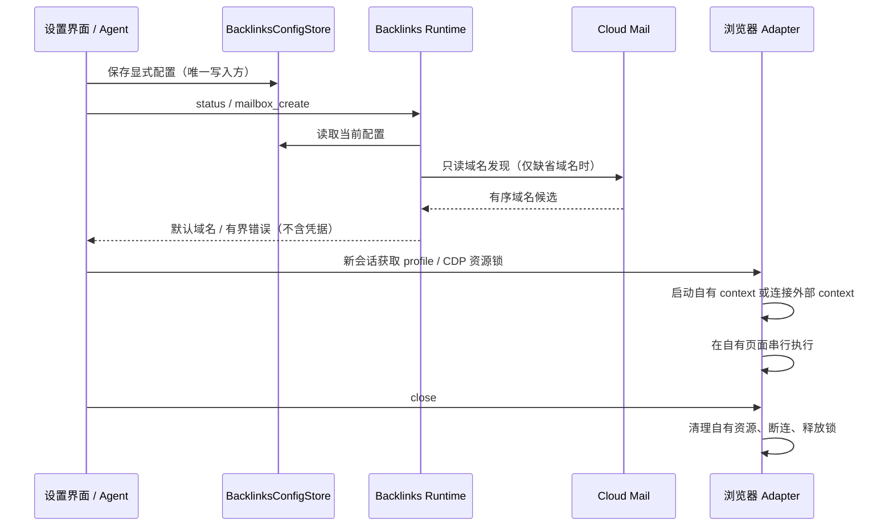

# 邮箱自动发现与已有浏览器复用

## 产品规则

- Cloud Mail 地址和令牌配置后，`backlinks_status` 只读查询 `/setting/websiteConfig` 的 `domainList`。去除前导 `@`、验证域名、去重，保留后台顺序。默认域名优先使用手动配置，否则使用后台首个候选；不根据 API 主机名猜测邮箱域名，不持久化推测值。
- `mailbox_create` 同样解析默认域名；失败仅阻塞需要新邮箱的条目。状态区分未配置、域名可解析、发现失败；域名查询成功不代表创建权限或收信已验证。实际创建仍由原有工具和权限流程处理。
- 发布技能以状态工具为配置事实源，禁止为补齐配置遍历其他项目、凭据或数据库文件；Google / 已登录站点无需邮箱时继续执行。
- 浏览器设置支持：默认工作区隔离 profile；用户明确选择的已有独立 `userDataDir`；本地 HTTP CDP 地址 `cdpEndpoint`。后两者互斥。设置入口和 MCP 复用同一份配置。
- 指定 profile 使用规范真实路径和独占锁，不复制 cookie、不删除 Chromium 锁、不接管正在使用且未开放 CDP 的 profile。CDP 只允许无凭据、查询、路径的 loopback HTTP origin，错误时不回退到空白浏览器。
- CDP 复用默认 context 的登录态，在新页中发布；已有页面可观察，不允许发布动作或关闭。结束时只关闭本实例创建的页并断开连接，绝不关闭外部 context / 浏览器。显式复用会共享账号；不同工作区通过同一个连接资源锁避免 LinkAgent 并发控制。
- 点击触发的新窗口由浏览器异步创建；`click` 返回不保证弹窗已经出现在 `tabs`。调用方有界重读 `tabs`，以 `openerPage`、URL 和标题确认来源，不根据“最后一页”猜测；集成测试也按该时序等待。
- 配置变更在新浏览器会话生效，运行中不自动切换；关闭工具再打开或重启任务读取新配置。

## 所有者与顺序

配置文件不新增版本，不修改任务 / SQLite / lease / Desktop 连续流及 Web 恢复协议。域名发现不新增缓存，后台仍为唯一事实源；每次调用有超时与取消，失败不重试写操作。

## 验收

- 只有 API 与令牌时，状态和创建均能解析真实服务提供的域名；手动域名优先；无域名、鉴权错误、无效响应不触发创建。
- 域名响应只投影白名单字段，不输出其他后台配置或令牌；仅查询状态不创建邮箱、不拉取邮件。
- 真实本地 Chromium：第二连接继承测试登录 cookie，能完成本地表单；关闭后外部浏览器和原始页面继续存活，自建页面被清理。
- 已有 profile 重开保留登录，锁冲突不删除外部锁；CDP 错误无空白浏览器回退。
- 设置界面保存 / 重载域名与两种复用配置，英文 / 中文可用；根类型检查、lint、架构和 CLI 对应检查如实报告。
