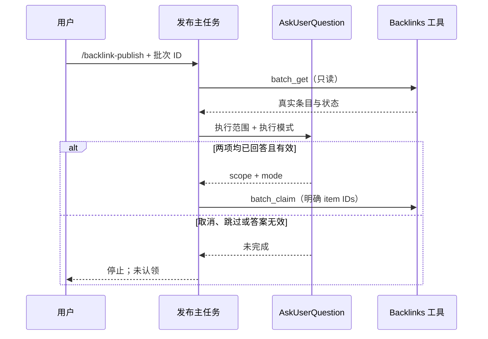
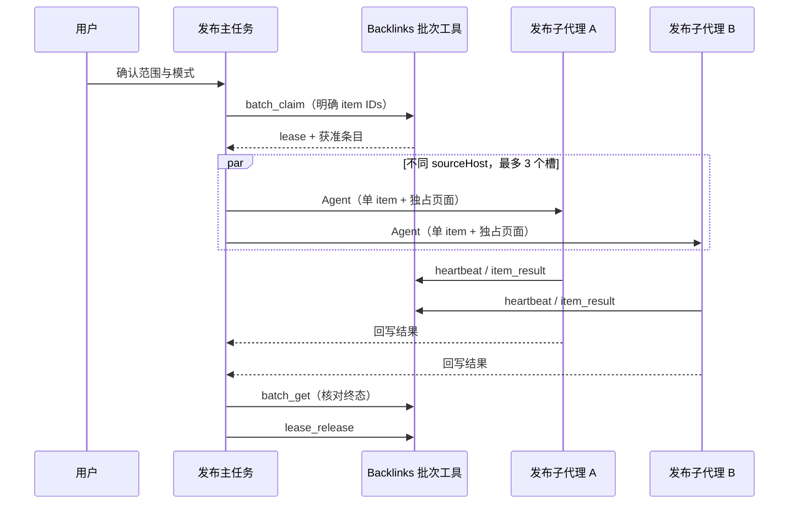

# LinkAgent 外链发布流程与链路验证

## 发布前双问答门槛

参考 harness 在批次详情读取完成后、任何认领或第三方站点操作之前，先由主任务调用一次原生 `AskUserQuestion`，在同一交互中展示两个问题：

1. **执行范围**：选择“全部可执行”时包含待发布与可重试失败，选择“仅待发布”时只包含 `pending`；使用客户端自带的“其他”输入逗号分隔的条目 ID，表示手选。无论哪种范围，已 `submitted` / `live`、已有 `publishedUrl`、同来源重复项和 `manual_required` 都不能被范围选项重新纳入。
2. **执行模式**：选择“智能匹配（推荐）”时只处理能匹配现有 playbook 的站点；选择“全部尝试”时未知类型也进入通用流程。该选择只影响本次运行。

从侧栏单批发布、批量发布或直接输入带批次号的 `/backlink-publish`，只确定批次，不代表范围或模式已经确定。主任务必须先读取所选批次详情，生成真实候选说明，再显示双问答。两项回答都齐全且可解析后，才可以计算明确的 item ID 集合并调用 `batch_claim`；取消、跳过、空回答、无法解析的手选 ID 或候选已失效，都停止本次流程，不认领、不用默认值代替用户选择。

技能文档是该交互状态的唯一规则所有者；侧栏仍只提交批次 ID，`AskUserQuestion` 及其回答由现有任务运行时持久化，批次后台继续拥有条目与租约事实。不得在 UI store 保存第二份范围或模式状态。



验收场景：发布入口提示词明确要求双问答；插件技能包含两个固定问题、选项映射和认领前门槛；直接命令和侧栏入口都加载相同技能；自动化测试只检查交互契约和本地模拟链路，不认领真实批次。

## 子代理发布调度

参考 harness 的发布器不是由一个模型顺序处理整批条目，而是由主任务统一确定范围并持有批次租约，再用有界滚动窗口把单条站点发布交给子代理。LinkAgent 使用原生 `Agent` 工具和插件提供的 `backlinks:backlink-publisher` profile 实现相同职责划分：

- 主任务是批次事实的唯一所有者，负责双问答、`batch_claim`、按 `sourceHost` 建队列、最多 3 个并发槽、等待全部子代理、最终核对与 `lease_release`。
- 一个子代理一次只处理一个 item，并使用 `batch-{batchId}-item-{itemId}` 独占页面。不同域名可并发，同域名、同 `sourceId`、共享 OAuth 或邮箱上下文的条目必须串行。
- 子代理只获得 `backlinks_worker`、`backlinks_browser` 和 `backlinks_status`。`backlinks_worker` 仅允许租约保活、单条结果回写、邮箱、徽标和来源标签操作；其输入契约拒绝查询、认领与释放批次。
- 每个子代理在最终提交前和分段等待邮件时续租；主任务仍拥有租约生命周期。子代理完成一条后，主任务才从对应域名队列补下一条，直到队列排空。
- 子代理退出但没有产生终态时，主任务先重新读取批次核对是否已回写。无法确认提交结果时写 `failed + manual_required`，不得重新提交；所有活跃子代理结束前不得释放租约。
- `Agent` 或专用 profile 不可用时，在认领前停止并报告能力缺失，不能静默退回单主任务发布。



验收场景：官方插件分发物包含专用 Agent profile；子代理工具 schema 接受保活与单条回写并拒绝批次查询、认领和释放；技能要求每次实际发布都通过专用 profile 分派，且明确 3 槽滚动调度和同域名串行；本地 Electron 链路实际出现父会话与子会话，并由子会话完成浏览器提交和结果回写。

## 根因

批次入口通过 `createTask()` 创建空会话后立即调用 V4 `sendText`，但没有传递现有的 `deferPersistenceUntilFirstPrompt` 参数。

Host 已返回任务元信息，CLI 的 session 主记录却尚未落库；V4 admission 写入 `session_input` 时触发外键失败。此时尚未进入网站发布阶段。参考 harness 的实现也是先建立会话再提交指令，迁移入口需要同时遵守 LinkAgent 自身的持久化契约。

## 修改

`packages/ui/src/lib/backlinksPublish.ts` 的任务创建请求补上 `deferPersistenceUntilFirstPrompt: true`。

这复用自动化任务已使用的机制：CLI admission 先调用统一的首发持久化边界，再写输入账本并返回 ACK。没有关闭外键、修改数据库结构、延时重试或新增数据库写入路径。工作区 identity、远程 session、trace 和插件准备顺序保持原样。

## 验证过程

1. 修改前，用真实 Electron、Host、Agent 和 SQLite 复现同样的 `FOREIGN KEY constraint failed`。
2. 修复后，发布指令被实际配置的本地测试模型接收。
3. 完整测试继续通过真实工具链执行以下操作：

| 检查点                                         | 实际结果              |
| ---------------------------------------------- | --------------------- |
| 加载 `backlinks:backlink-publish` 技能         | 成功                  |
| 专用 `backlinks:backlink-publisher` 子会话     | 创建 1 个并实际完成   |
| 子会话 MCP 工具面                              | 仅 worker/browser/status |
| MCP 工具链步骤                                 | 13 步                 |
| 读取并认领本地测试批次                         | 认领 1 次             |
| 租约保活                                       | 2 次（父、子各 1）     |
| 真实 Chrome 导航、填写并提交测试表单           | 提交 1 次，无重复提交 |
| 用匹配目标 href 的浏览器 selector 核验公开链接 | 成功                  |
| 后台接收 `live` 结果及证据                     | 回写 1 次             |
| 释放租约                                       | 1 次                  |
| SQLite `PRAGMA foreign_key_check`              | 0 项错误              |
| 输入账本和 session 父记录关联                  | 有效                  |
| 子会话 `parent_id` 与父会话关联                | 有效                  |

测试的模型响应、批次后台和目标网站均为本机临时服务；Electron、Host、父 Agent、发布子 Agent、技能、MCP、浏览器和 SQLite 均实际运行。测试经现有“仅允许这一次”权限交互执行，不切换为完全访问模式。Agent DB 显式使用临时目录中的 `agent-sessions.sqlite`。完整链路覆盖一个真实发布子代理；三槽并发、同域名串行及滚动补位由技能契约回归覆盖，没有对真实网站启动多个发布任务。

## 检查结果

- 53 项核心、插件、命令和 UI 回归通过。
- 完整发布 Electron E2E 通过，包含真实父子会话、受限子代理 MCP、公开核验、回写与释放。
- 浏览器 UI E2E（多选、模拟 admission、失败恢复、配置及窄屏）通过。
- 根项目 `pnpm typecheck` 与 CLI 28 个 Turbo 类型检查通过；`pnpm lint` 为 66 warnings、0 errors；`pnpm architecture:check --changed` 为 0 新违规；本次文件格式检查通过。全仓格式检查仍只报告既有 `harness/linkagent/MAIL-BROWSER-DELIVERY.zh-CN.md`。

复跑完整链路（先确保桌面开发服务和构建就绪，且已安装 Chrome）：

```sh
node --test packages/desktop/test/backlinksPublish.e2e.mjs
```

测试代码位于 `packages/desktop/test/backlinksPublish.e2e.mjs` 和 `test/fixtures/backlinksPublishServer.mjs`。子代理 profile 位于 `apps/zcode-cli/packages/backlinks-plugin/agents/backlink-publisher.md`，受限工具契约位于 `packages/backlinks/src/domain/commands.ts`，发布调度规则位于插件技能。

## 使用及边界

重新点击批次的「发布」或「批量发布」会建立新任务。若出现工具权限卡片，按当前权限模式确认后继续。

本轮没有向真实网站提交、认领真实批次或写回真实后台结果，也没有推送/发布仓库。生产网站的账号、验证码、审核与真实模型表现仍需对应环境验收；既有失败空任务没有被批量清理。
