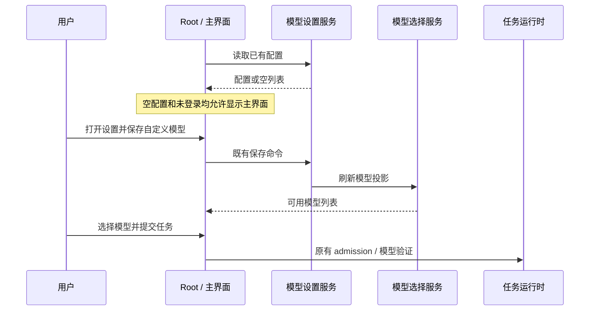

# LinkAgent 客户端：免登录入口与品牌

## 产品规则

- 首次安装、未登录、未添加模型或断开账号后均可进入主界面，访问设置、项目及已迁移的外链控制台。不得伪造登录态或注入虚假模型。
- 模型由用户在「设置 → 模型供应商」配置，继续使用现有供应商、API 格式、Base URL、API Key、模型列表及持久化接口。真正发送任务仍遵守已有模型可用性检查。
- 未登录且无可用模型时，提示用户前往设置配置；不在这条提示里推荐购买账号套餐。
- 账号连接是设置中的可选能力；主动打开的登录页提供返回主界面入口。账号过期不强制切换到登录页。首次职业/偏好引导只由用户主动打开，不阻塞工作区。
- 客户端名称为 LinkAgent；开发与预览实例分别显示 LinkAgent Dev / LinkAgent Preview。主窗口、启动图、关于页、菜单、应用包和图标一致。新的应用安装身份避免覆盖原版 ZCode。
- 用 imagegen 生成全新图标，保存 PNG 母版及生成提示词，派生 macOS ICNS、Windows ICO、Linux 多尺寸 PNG 并接入实际运行窗口。
- LinkAgent 正式版只从明确绑定的 `javawl/ZCode-Link` GitHub Releases 检查桌面更新；不得请求原版 ZCode 的更新清单或强制升级接口。开发版和 Preview 身份不自动更新。

## 所有者与边界

### 开发数据隔离与启动入口

- `pnpm dev:desktop` 是 LinkAgent 桌面开发的唯一默认入口。该入口必须在启动 Electron、Host 和 Agent 前，把数据根固定为 `~/.zcode-link-dev-home`，并由同一个根派生 `ZCODE_DATA_BASE_DIR`、`ZCODE_DESKTOP_HOME_DIR`、`ZCODE_HOME` 与 `ZCODE_DESKTOP_USER_DATA_DIR`。
- LinkAgent 启动入口是开发数据根的唯一所有者。它不得继承通用 ZCode 的 `ZCODE_DATA_BASE_DIR` 等路径覆盖，避免读取 `~/.zcode` 中的项目、任务、模型与设置；需要另一个 LinkAgent 开发空间时，只能通过 `LINKAGENT_DEV_DATA_BASE_DIR` 指定绝对路径。
- 启动隔离只改变进程读取位置，不复制、迁移、清空或合并 LinkAgent 与 ZCode 的任何数据。已有 `~/.zcode-link-dev-home` 必须原位复用。
- `dev:desktop:test` 与 `dev:desktop:prod` 保留为明确的底层环境入口，供隔离 E2E 或显式开发场景注入自己的数据目录；它们不是 LinkAgent 的日常默认启动命令。

```text
pnpm dev:desktop
  → LinkAgent 启动入口（数据根唯一所有者）
  → ~/.zcode-link-dev-home
     ├─ .zcode/v2/{setting,provider_config,backlinks,tasks-index}
     └─ electron-user-data
```

### 客户端去商业化

- 所有账号状态下均不显示套餐卡片、Start Plan / Coding Plan 商城、升级/购买/支付/充值、余额推广、套餐徽标、付费额度重置和推荐购买弹窗。
- 模型设置只展示可配置的 API 供应商、模板与模型编辑；沿用现有本地 ProviderSettingsService 的保存、排序、删除、连接测试和模型参数接口。
- 全局旧购买调用采用明确的停用契约：不加载购买 WebView、不拉取商品目录、不启动支付；旧调用方得到未打开结果。不是 CSS 隐藏。
- 头像菜单不订阅套餐权益，不展示商业摘要；上下文 token 统计与本地任务使用统计仍可用。
- 保留服务端鉴权、账号与存量配置，不解除付费限制、不伪造权益、不自动删除已配置供应商。
- E2E 覆盖空白启动、头像菜单、模型设置、模板新增、保存/重启、使用统计与外链设置，确认没有升级/购买/支付控件。

- Root 负责是否显示可选登录页；OAuthService 仍是账号事实的唯一所有者。UI 不写凭据、不改变服务端鉴权、分享权限或远控配对规则。
- ProviderSettingsService / ModelSelectionService 继续拥有模型配置、持久化和可用性。设置页通过已有 hooks / RPC 访问；不新建第二份模型配置。
- OccupationOnboarding 保留设置页的显式打开能力，自动展示由 Root 的产品策略关闭。
- Desktop product identity 负责安装名称和应用 ID；现有 `@zcode/*` 包名、协议、环境变量及数据格式保留兼容，不全局替换内部标识、服务地址、canonical 或第三方品牌。
- 外链插件、浏览器隔离、租约与任务提交链路不改变。Desktop continuous 与 Web remote replayable 继续复用原有 owner。



## 验收

1. 全新隔离数据目录、无账号/密钥启动：显示主界面，没有强制登录或职业引导。
2. 可以打开模型设置，自定义供应商和模型无需账号即可保存；重启后仍存在，允许删除最后一个配置后继续访问主界面。
3. 无模型时不会发出真实模型请求；可选登录页可以返回，账号过期不替换工作区。
4. 外链设置与控制台可访问；本次不向真实平台发布，不使用真实密钥测试。
5. 标题、菜单、关于页、新图标与开发应用包可实际检查；品牌 identity 测试覆盖三个桌面平台的命名。
6. 执行相关单测、桌面 E2E、pnpm typecheck、pnpm lint 和 architecture:check --changed；分别记录已有失败与本次新增问题。
7. 即使父 shell 已设置指向普通 ZCode 的路径变量，`pnpm dev:desktop` 仍只解析到 LinkAgent 独立目录；显式的 `LINKAGENT_DEV_DATA_BASE_DIR` 必须是绝对路径，并能让四个运行时路径保持同根。

## 交付边界

本任务修改本地源码和资源并运行开发客户端。不推送、发布、签名或部署；完整 Windows/Linux 安装包实机验证另行记录为未执行。
