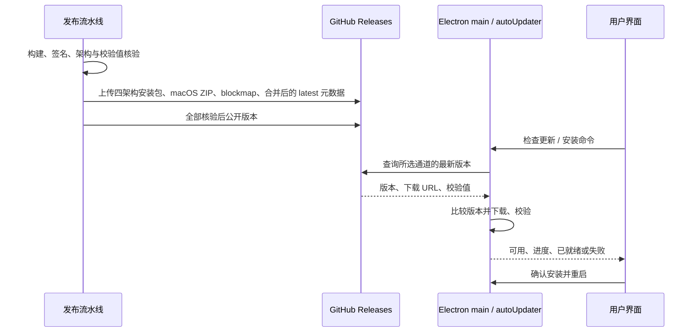

# LinkAgent 桌面在线更新规格

## 产品规则与迁移

- 正式安装包使用 `dev.linkagent.app` 身份，更新源固定为公开仓库 `javawl/ZCode-Link` 的 GitHub Releases。不能从构建机 Git remote、上游 ZCode 服务或运行时可覆盖的环境变量推断正式更新源。
- 启动后后台检查，每小时轮询，用户也可点现有「检查更新」入口。沿用同一个 Electron main `autoUpdater` 状态机和现有下载、取消、跳过版本、重启安装入口；不在 UI 新建更新状态所有者。
- 稳定版默认只接收正式 Release。用户开启「接收预览版更新」后，下一次检查可接收预发布；关闭后恢复稳定版筛选。通道切换不得使进行中的检查结果写成新通道，也不得自动降级。
- Preview 身份和未打包开发态不执行生产自动更新。原版 ZCode 服务端的强制升级 gate 始终关闭。
- 已发布的 3.14.0 禁用自动更新且 macOS 包未签名，因此老用户须手动安装一次带更新能力的新版本；此后才可在客户端升级。

## 状态与事件顺序

Electron main 中的 `autoUpdater` 唯一拥有检查、下载和安装状态；GitHub Release 与随包元数据是远端版本事实，renderer 只展示状态并发命令。版本号、下载文件及其 SHA-512 必须来自同一构建批次。发布时先准备所有平台产物与元数据，完整核验后再公开 Release；草稿和不完整版本不可见。

## 打包与发布约束

- macOS arm64/x64 同时构建 DMG 和 ZIP；Windows arm64/x64 构建 NSIS EXE。汇总元数据时保留每个架构的文件和校验值，禁止后一次构建覆盖前一次生成的 `latest-mac.yml` 或 `latest.yml`。
- 正式 macOS 自动更新要求有效的 Developer ID Application 签名，面向用户发布还须完成公证。Windows 发布建议 Authenticode 签名。缺少 macOS 凭据时，未签名包只能作为测试产物，不能宣称可在线升级。
- 打包命令只产生本地产物，不隐式上传；推送与 Release 公开发布由单独步骤执行。
- 用户数据根和应用 ID 不因更新变化；升级失败保留当前已安装版本和设置。回滚通过发布更高版本号的修复版完成，不覆盖同名版本或重写旧元数据。

## 验收

1. 已安装的上一个可更新正式版在 macOS arm64/x64、Windows arm64/x64 上发现新版本，文件名与架构一致。
2. 无新版本、网络错误、校验失败、取消下载和重启安装均展示准确状态；用户设置与任务数据仍在。
3. 稳定通道不接收预发布，开启预览开关后可接收预发布；Preview 身份不会请求正式仓库。
4. 构建输出包含完整的四架构产物及双平台元数据，校验值与真实文件一致，公开 Release 前全部下载链接可用。
