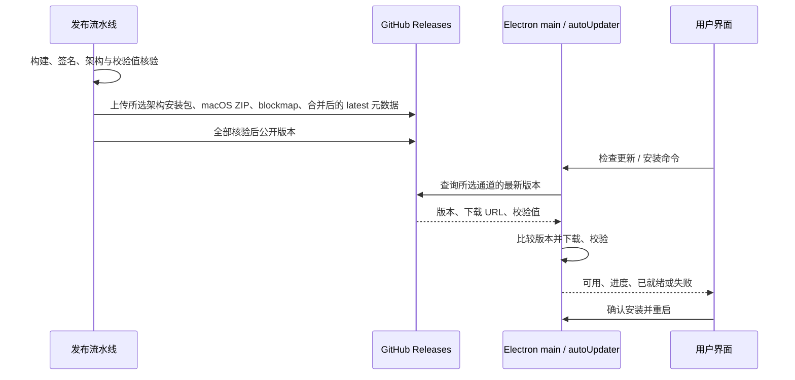
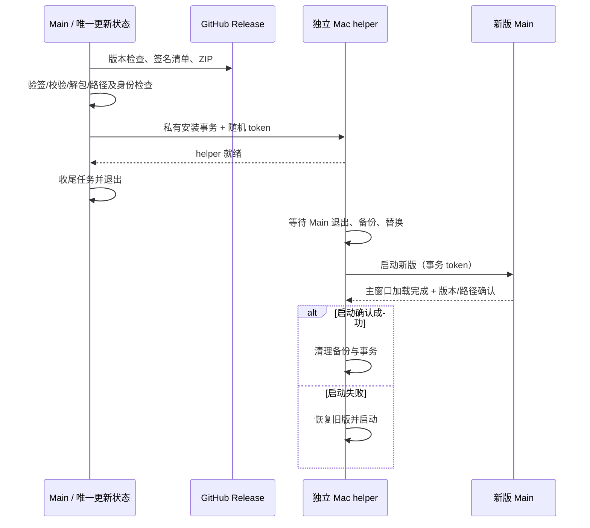

# LinkAgent 桌面在线更新规格

## 产品规则与迁移

- 正式安装包使用 `dev.linkagent.app` 身份，更新源固定为公开仓库 `javawl/ZCode-Link` 的 GitHub Releases。不能从构建机 Git remote、上游 ZCode 服务或运行时可覆盖的环境变量推断正式更新源。
- 启动后后台检查，每小时轮询，用户也可点现有「检查更新」入口。沿用同一个 Electron main `autoUpdater` 状态机和现有下载、取消、跳过版本、重启安装入口；不在 UI 新建更新状态所有者。
- 稳定版默认只接收正式 Release。用户开启「接收预览版更新」后，下一次检查可接收预发布；关闭后恢复稳定版筛选。通道切换不得使进行中的检查结果写成新通道，也不得自动降级。
- Preview 身份和未打包开发态不执行生产自动更新。原版 ZCode 服务端的强制升级 gate 始终关闭。
- 已发布的 3.14.0 禁用自动更新且 macOS 包未签名，因此老用户须手动安装一次带更新能力的新版本；此后才可在客户端升级。

## 状态与事件顺序

Electron main 中的 `autoUpdater` 唯一拥有检查、下载和安装状态；GitHub Release 与随包元数据是远端版本事实，renderer 只展示状态并发命令。版本号、下载文件及其 SHA-512 必须来自同一构建批次。发布时先准备所有平台产物与元数据，完整核验后再公开 Release；草稿和不完整版本不可见。

```mermaid
sequenceDiagram
    participant P as 发布流水线
    participant G as GitHub Releases
    participant M as Electron main / autoUpdater
    participant U as 用户界面
    P->>P: 构建、签名、架构与校验值核验
    P->>G: 上传所选架构安装包、macOS ZIP、blockmap、合并后的 latest 元数据
    P->>G: 全部核验后公开版本
    U->>M: 检查更新 / 安装命令
    M->>G: 查询所选通道的最新版本
    G-->>M: 版本、下载 URL、校验值
    M->>M: 比较版本并下载、校验
    M-->>U: 可用、进度、已就绪或失败
    U->>M: 确认安装并重启
```

## 打包与发布约束

- macOS arm64/x64 同时构建 DMG 和 ZIP；Windows arm64/x64 构建 NSIS EXE。每次发布可通过汇总脚本的 `--targets` 显式指定平台集合，默认仍为全部四架构。所选平台必须有效、非空且不重复；只复制所选平台的文件，并只生成这些平台对应的升级清单。清单保持 x64 优先的顺序，禁止后一次构建覆盖前一次生成的 `latest-mac.yml` 或 `latest.yml`。
- `v4.0.0` 的平台集合固定为 `mac-arm64,mac-x64,win-x64`，不构建或发布 Windows ARM64 产物。Release 源码提交先在本地固定，再从该提交构建，确保包内构建标识与发布标签一致。本次按用户要求在重新构建及本地验证通过后清理旧版本和旧 4.0.0 产物；保留新版本、源码和用户配置。远端历史 Release 不因本地清理而变化。
- 内部版 macOS 从 4.0.0 起使用独立安装程序，不调用 Squirrel.Mac 安装；无需 Apple Developer ID。GitHub 的 `linkagent-update.json` 必须由项目的 Ed25519 发布私钥签名，客户端内置对应公钥，拒绝缺失签名、错误仓库/应用/版本/架构或校验不一致的更新。公钥不接受运行时覆盖；私钥只保存在构建机的仓库外，后续发布必须复用并备份该私钥。此签名不替代 Apple 签名/公证，首次安装和系统权限仍遵守 macOS 的要求。Windows 继续使用 NSIS 更新流程，建议 Authenticode 签名。
- 打包命令只产生本地产物，不隐式上传；推送与 Release 公开发布由单独步骤执行。
- 用户数据根和应用 ID 不因更新变化；升级失败保留当前已安装版本和设置。回滚通过发布更高版本号的修复版完成，不覆盖同名版本或重写旧元数据。

## 验收

1. 已安装的上一个可更新正式版在本次选择的平台上发现新版本，文件名与架构一致。
2. 无新版本、网络错误、校验失败、取消下载和重启安装均展示准确状态；用户设置与任务数据仍在。
3. 稳定通道不接收预发布，开启预览开关后可接收预发布；Preview 身份不会请求正式仓库。
4. 构建输出包含完整的所选平台产物及对应元数据，不引用未选平台的旧文件；校验值与真实文件一致，公开 Release 前全部下载链接可用。

## 内部版 Mac 安装事务（4.0.0）

- 主进程仍是唯一更新状态所有者。Mac 适配器复用 electron-updater 的 GitHub 版本选择、稳定/预览通道、下载缓存、取消和 UI 事件；只替换下载校验及安装实现，不在 renderer 新建更新状态。
- 发布清单固定 schema、仓库、appId、版本和两个 Mac ZIP 的大小/SHA-512。先验证 Ed25519，再把所选文件与 GitHub `latest-mac.yml` 比对；ZIP 必须与运行进程架构相同。缺少签名的旧版本不可自动安装；禁止降级。
- 点击安装先确认运行于可写的真实 `.app` 路径（安装盘或只读/无写权限的目录提示移动到当前用户可写目录），在目标旁创建私有事务目录；检查 ZIP 目录穿越、应用身份/版本/Mach-O 架构，完整解包验证后才执行现有任务退出准备。
- 独立 helper 从缓存启动并明确回执就绪后，主进程退出。helper 等待该主进程退出，重新验证文件和身份，串行执行 `旧 app → backup`、`已验证新 app → 原路径`。事务日志记录每一步；独占锁防止两个安装程序交错。父进程不退出时超时取消，不杀其他进程。
- helper 直接启动新程序，只有新主进程的真实主窗口完成页面加载后，以随机事务 token、准确版本和路径确认启动成功。失败、退出或到达启动期限仍未确认时，helper 只终止自己创建的更新进程，恢复 backup 并启动旧版。成功后清理 backup 和 staging；用户数据目录不参与替换。启动/退出期限仅限制等待，不把超时当成功。
- 安装只在明确点击「重启更新」时执行；内部 Mac 不在普通退出时偷偷安装。现有自动下载开关仍控制后台下载，运行任务的确认流程沿用原入口。
- 分别验证签名错误、校验错误、架构错误、取消、下载缓存复用、权限失败、安装成功、启动失败回滚、重复安装和真实打包客户端重启；不把开发态 relaunch 当安装成功。

```mermaid
sequenceDiagram
    participant M as Main / 唯一更新状态
    participant G as GitHub Release
    participant H as 独立 Mac helper
    participant N as 新版 Main
    M->>G: 版本检查、签名清单、ZIP
    M->>M: 验签/校验/解包/路径及身份检查
    M->>H: 私有安装事务 + 随机 token
    H-->>M: helper 就绪
    M->>M: 收尾任务并退出
    H->>H: 等待 Main 退出、备份、替换
    H->>N: 启动新版（事务 token）
    N-->>H: 主窗口加载完成 + 版本/路径确认
    alt 启动确认成功
        H->>H: 清理备份与事务
    else 启动失败
        H->>H: 恢复旧版并启动
    end
```
