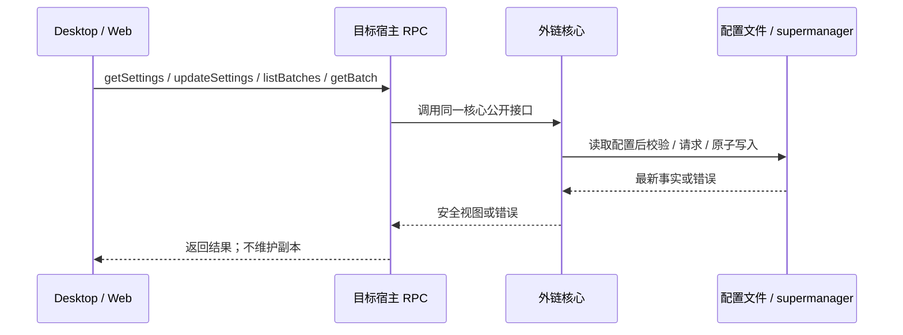

# 外链设置与批次服务

完整迁移规范见 `harness/backlinks/SPEC.md`。

`IBacklinksService` 是 Desktop、Web 与远程工作区共同使用的窄化 RPC 契约，
仅提供配置读取、配置更新、批次列表和单批次详情四个方法。

- 配置唯一所有者是 `@zcode/backlinks` 的配置存储适配器；服务不保存配置副本、
  不另写 settings.json，不缓存批次，不返显 token。
- 创建宿主服务时解析一次 `getDataBaseDir()` 并注入核心运行时；随后每次调用均
  经过核心公开接口读取最新配置。同一宿主的 MCP 工具和 UI 使用同一配置文件。
- `updateSettings` 的校验和原子写入由核心负责。错误原样上抛，调用失败时不伪造成功。
- 批次与条目的事实由 supermanager 持有；此服务不提供租约或发布写入，发布沿用
  正常 Agent 会话和官方插件入口。
- Desktop 与 Web 远程工作区的该服务必须透传目标宿主服务；连接不提供时不注册本机替代实现。

验收：代理经过 `backlinks` channel 调用正确方法；同一核心实例更新后立即读取
新值；远端配置不落入本机；服务工厂创建后改变默认数据目录不迁移旧实例的配置。
